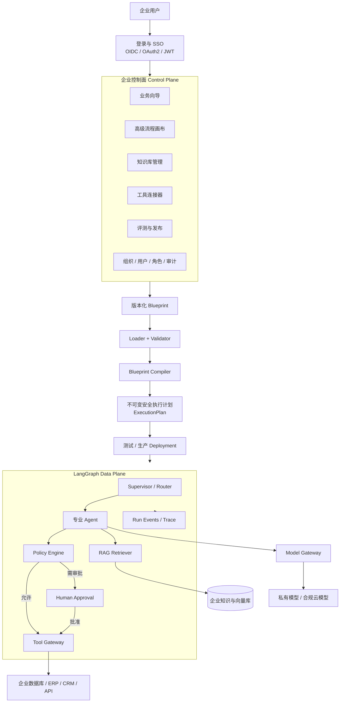

# AgentBlueprint 企业平台目标架构

状态：Accepted  
目标版本：v1.0  
最后更新：2026-09-02

## 1. 产品定义

AgentBlueprint 是一个面向企业的智能体生成、治理与发布平台。业务人员通过向导或受约束的流程画布描述业务，系统将描述转换为可校验的 Blueprint，再编译成不可变的安全执行计划，最后由 LangGraph Runtime 执行。

平台不让模型直接访问企业数据库、知识库或工具。模型只能提出检索或工具调用请求，真正的权限、策略、审批和执行全部由服务端确定性代码完成。

## 2. 总体架构



这张图中，Control Plane 负责“设计和管理”，Data Plane 负责“执行请求”。两者必须分开部署、授权和扩缩容。

## 3. 分层职责

### 3.1 Identity Gateway：回答“你是谁”

职责：

- 对接企业 OIDC、OAuth2 或 SAML SSO。
- 验证 Access Token，生成服务端 `RequestContext`。
- 从已验证身份中取得 `organization_id`、`user_id` 和 `roles`。
- 禁止使用前端提交的 `tenant_id` 作为授权依据。

输出：

```text
RequestContext
├── organization_id
├── user_id
├── roles
├── permissions
└── request_id
```

### 3.2 Enterprise Console：回答“企业要构建什么”

业务向导面向不懂 AI 的业务负责人；高级画布面向 AI 应用开发者。两种界面编辑的是同一个 Blueprint，不允许形成两套互不兼容的数据。

- 业务向导：目标、用户、知识、工具、规则、审批和成功标准。
- 高级画布：Blueprint 允许的 Agent、RAG、Condition、Tool、Approval 和 Output 节点。
- 知识库：文档、版本、权限、索引和生命周期。
- 工具连接器：API 定义、凭据引用、风险级别和允许角色。
- 评测与发布：数据集、回归结果、门禁、环境和回滚。

### 3.3 Blueprint Compiler：回答“配置是否合法、如何执行”

编译链保持确定性：

```text
Blueprint
→ Schema Validation
→ Semantic Validation
→ Normalize
→ Permission Expansion
→ Policy Compilation
→ Graph Compilation
→ ExecutionPlan + SHA-256
```

编译器不访问真实密钥、不调用模型、不执行工具。同一 Blueprint 必须产生同一 Plan ID，便于审计、缓存和回滚。

### 3.4 Safe ExecutionPlan：运行时唯一可信配置

生产运行时不直接读取草稿 Blueprint，只执行已经编译、评测并发布的 ExecutionPlan。计划至少包含：

- Agent 指令和委派白名单。
- 图节点、边、条件和终止规则。
- 知识源及角色过滤规则。
- 工具参数结构、允许角色、风险和审批策略。
- 模型、步骤、时间、工具调用和成本预算。
- 评测版本、内容哈希和发布环境。

### 3.5 LangGraph Runtime：回答“这次请求如何安全完成”

LangGraph 管理共享状态、路由、并行、暂停和恢复；LangChain 管理模型、Retriever、工具适配和单 Agent 循环。

一次运行的状态机为：

```text
CREATED → RUNNING → WAITING_APPROVAL → RUNNING → COMPLETED
                    ↘ REJECTED
RUNNING → FAILED / CANCELLED / LIMIT_REACHED
```

运行状态必须使用 PostgreSQL/Redis 等持久化 Checkpointer，不能依赖进程内存。

### 3.6 RAG Knowledge Service：回答“允许看到哪些依据”

知识链路：

```text
文档上传
→ 病毒与格式检查
→ 文本解析
→ Prompt Injection / 敏感信息扫描
→ 上下文增强切片
→ Embedding
→ 向量索引
→ 混合检索
→ 权限过滤
→ Rerank
→ 上下文压缩
→ 带版本引用的结果
```

权限过滤必须在检索阶段执行，不能先取出其他部门内容再要求模型“不要泄露”。

### 3.7 Tool Gateway：回答“AI 是否可以执行这个动作”

任何企业工具必须经过统一入口：

```text
参数校验
→ 身份与组织检查
→ 角色权限
→ 风险策略
→ 审批状态
→ 幂等检查
→ Secret 注入
→ 实际调用
→ 脱敏审计
```

模型没有数据库账号和真实 API Key。Connector 只保存 `secret_ref`，运行时从 Secret Manager 临时取得凭据。

### 3.8 Evaluation & Release：回答“这个版本是否可以上线”

生产发布必须满足：

- Blueprint 编译成功。
- 知识和连接器状态正常。
- 回答质量、引用、授权、工具选择和审批测试通过。
- 安全测试与 Prompt Injection 测试通过。
- 达到最低分数且没有阻断项。
- 发布人具备生产权限，发布行为进入审计日志。

## 4. 核心数据对象

```text
Organization
├── Membership ── User
├── Role / Permission
├── Blueprint ── BlueprintVersion
├── KnowledgeSource ── Document ── DocumentVersion
├── Connector ── Operation ── SecretRef
├── EvaluationSuite ── EvaluationRun
├── Deployment
└── Run ── RunEvent ── ApprovalRequest
```

所有企业数据表都必须包含 `organization_id`。生产数据库应使用服务层过滤加数据库行级安全的双重隔离。

## 5. 强制安全不变量

以下规则不能由 Prompt 或模型自行决定：

1. `organization_id` 只能来自服务端验证后的身份。
2. 模型、用户输入、上传文档和外部工具输出一律视为不可信数据。
3. 密钥不得进入 Blueprint、Prompt、日志、Git 或前端。
4. RAG 必须先做组织和角色过滤，再返回上下文。
5. 写操作必须通过 Tool Gateway，并具有幂等键。
6. 高风险操作必须在副作用发生前完成人工审批。
7. 草稿不能直接运行生产流量；生产只运行已发布的不可变计划。
8. 每次模型、检索、工具、审批和发布行为都产生脱敏审计事件。
9. 数据静态、传输中和运行状态都必须加密。
10. 企业可以配置数据保留期限、删除、导出和模型供应商策略。

## 6. 推荐部署拓扑

```text
Reverse Proxy / API Gateway
├── Web Console
├── Identity API
├── Control Plane API
├── Runtime Workers
├── Knowledge Workers
└── Connector Workers

Infrastructure
├── PostgreSQL + pgvector
├── Redis / Task Queue
├── S3 / MinIO
├── Secret Manager / KMS
├── OpenTelemetry Collector
└── 企业 IdP 与模型服务
```

第一版使用 Docker Compose 完成单机私有部署；模块边界保持容器化，以便后续迁移到 Kubernetes，但 v1 不建设 Kubernetes 管理平台。

## 7. 代码目录目标

```text
backend/app/
├── identity/       登录身份、RequestContext、组织和角色
├── authoring/      Blueprint 草稿与画布保存
├── blueprint/      Schema、Loader、Validator
├── compiler/       ExecutionPlan 编译
├── deployments/    测试/生产发布与回滚
├── runtime/        LangGraph 构建、状态和执行
├── knowledge/      文档摄取、索引和权限
├── rag/            检索、重排和压缩
├── connectors/     Connector Registry 与适配器
├── governance/     Policy、Approval、Audit、DLP
├── evaluation/     数据集、Runner 和 Release Gate
├── observability/  Trace、Metric、Cost 和告警
└── storage/        PostgreSQL、对象存储和事务
```

## 8. 实施顺序

### 阶段 A：企业安全底座

- Organization、User、Membership、Role 数据模型。
- JWT/OIDC 身份验证和 `RequestContext`。
- PostgreSQL 与迁移工具。
- 服务端租户隔离和数据库行级安全测试。
- PostgreSQL LangGraph Checkpointer。

验收：伪造 `tenant_id` 无法访问其他组织；服务重启后等待审批可以恢复。

### 阶段 B：控制面与 Blueprint 双向编辑

- 业务向导和画布统一保存为 Blueprint。
- 节点、连线、条件和配置完整映射。
- Blueprint 与画布双向转换。
- 草稿、版本、测试、生产和回滚。

验收：界面产生的每个节点都能编译为对应的 ExecutionPlan 节点。

### 阶段 C：生产知识服务

- PDF、DOCX、TXT 上传与解析。
- MinIO/S3、真实 Embedding、PostgreSQL + pgvector。
- 权限过滤、版本、重建索引和删除。
- Prompt Injection 与敏感信息检测。

验收：不同角色搜索同一问题只能取得各自有权查看的片段。

### 阶段 D：连接器和安全运行时

- REST/OpenAPI、只读 SQL 和 MCP 连接器。
- Secret Manager、网络出口白名单和超时重试。
- Policy Engine、审批中心、幂等写操作。
- 持久 RunEvent 和可恢复执行。

验收：模型无法绕过 Gateway；任何审批型工具在批准前副作用次数为零。

### 阶段 E：评测、发布和运营

- 版本回归、安全评测和发布门禁。
- OpenTelemetry、成本、延迟、错误率和审计查询。
- Docker Compose 私有部署、备份和恢复。
- 知识助手、售后退款、采购审核三个模板。

验收：新企业能在 15 分钟内从模板生成测试版本，并完成一次可审计运行。

## 9. 当前实现映射

| 目标模块 | 当前状态 | 下一步 |
|---|---|---|
| 企业控制台 | 已有向导、画布和管理页原型 | 完成画布与 Blueprint 双向映射 |
| Blueprint Compiler | 已有可运行实现 | 增加组织策略和部署版本输入 |
| LangGraph Runtime | 已有多 Agent、RAG 和审批 | 将内存 Checkpointer 换为 PostgreSQL |
| RAG | 已有上下文切片、重排和压缩 | 接入真实解析、Embedding 与 pgvector |
| Policy / Tool Gateway | 已有权限、策略、审批和幂等骨架 | 接入真实身份、Secret Manager 和持久审计 |
| 评测与发布 | 已有评测和门禁 | 增加回归比较、安全数据集与回滚 |
| 登录 / SSO | 未实现 | 作为下一开发阶段首要任务 |
| 私有部署与运维 | 未实现 | 完成生产存储后增加 Docker Compose |

## 10. 产品边界

AgentBlueprint 的优势不是提供无限自由的节点市场，而是将企业业务要求编译成安全、可测试、可发布的执行计划。

v1 支持 Blueprint 规范内的受约束画布；不支持任意代码节点、模型直接执行 SQL、无审批的高风险动作、百种连接器市场和自主修改生产系统。
